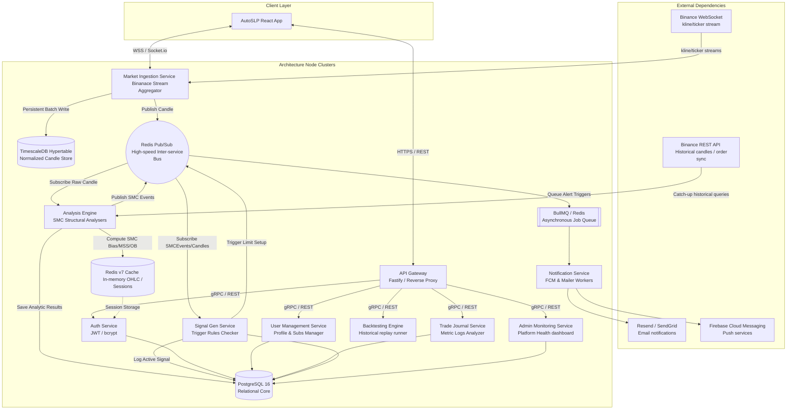

# AutoSLP Backend System Architecture & Implementation Specifications

This document serves as the complete, production-ready backend engineering blueprint for **AutoSLP**, an institutional-grade Smart Money Concepts (SMC) automation, POI plotting, and trailing-limit signaling engine.

---

## PART A: SYSTEM ARCHITECTURE OVERVIEW

### Mermaid System Topography Diagram

Below is the complete service communication topography mapping high-speed kline stream normalization, cache-backed analysis, asynchronous worker distribution, and multi-tenant telemetry sync.



---

## PART B: TECHNOLOGY CHOICES & COMPLEMENTARY JUSTIFICATION

The AutoSLP backend leverages a modular, highly performant TypeScript ecosystem. Below is the operational justification for each selection in our catalog:

*   **Runtime: Node.js 20+ (LTS) with Assembly-Aided TS**
    *   *Justification*: Native type validation stripping and V8 performance optimizations reduce memory heap footprints. The async loop handles I/O heavy streaming queries (such as processing 100+ concurrent market tickers) with sub-millisecond execution times.
*   **Framework: Fastify (v4+)**
    *   *Justification*: Fastify achieves up to 2-3x higher requests-per-second than alternative frameworks (e.g. Express) by compiling JSON serializers dynamically with `fast-json-stringify` and utilizing highly optimized trie-based internal routers (`find-my-way`). It supports built-in schema-based validation out-of-the-box.
*   **Real-time Layer: Socket.io**
    *   *Justification*: Provides auto-reconnection headers, server-demarcated namespaces, cluster clustering support, and fallbacks to HTTP long-polling if raw WebSockets are blocked by corporate firewalls.
*   **Primary DB & Time-Series: PostgreSQL 16 + TimescaleDB Extension**
    *   *Justification*: PostgreSQL 16 guarantees strict ACID consistency for user transactions, trade journals, and target configurations. Under the same engine, TimescaleDB converts candlesticks into automated partitions (*Hypertables*). Hypertables slice candle records chronologically, facilitating faster aggregate window indexing (`time_bucket()`) on millions of historical candles without table locks.
*   **Caching & Inter-service Bus: Redis v7**
    *   *Justification*: Maintains atomic sub-millisecond key lookups for user session headers. In-memory data blocks house active kline data (L1 cache) and feed raw events into the WebSocket stream. The Redis Pub/Sub framework serves as the low-latency inter-service backplane.
*   **Message Broker & Tasks: BullMQ (Redis-Backed)**
    *   *Justification*: Manages distributed processing of non-blocking tasks (e.g., executing email distribution, generating push notification banners, recalculating multi-year backtests). Supports guaranteed at-least-once execution, exponential backoff retries, and rate-limiting limits per user tier.
*   **ORM: Prisma**
    *   *Justification*: Standardizes database modeling under a unified declarative format. Generating type-safe relations eliminates runtime query parameter mapping drift and helps developers catch invalid database operations during compile-time lint sweeps.

---

## PART C: DATABASE SCHEMA (PRISMA DEFINITION)

Below is the complete, single-file schema specification. Copy and place this file within `/prisma/schema.prisma` inside your database service layer:

```prisma
datasource db {
  provider = "postgresql"
  url      = env("DATABASE_URL")
}

generator client {
  provider = "prisma-client-js"
}

// ==========================================
// ENUMS definitions
// ==========================================

enum Plan {
  FREE
  PREMIUM
  ENTERPRISE
}

enum POIType {
  ORDER_BLOCK
  BREAKER_BLOCK
}

enum POIStatus {
  ACTIVE
  MITIGATED
  TESTED
}

enum Direction {
  LONG
  SHORT
}

enum SignalStatus {
  PENDING
  ACTIVE
  HIT_TP1
  HIT_TP2
  STOPPED
}

enum AlertType {
  PRICE_ENTERS_POI
  BIAS_CHANGE
  MSS_DETECTED
  PRICE_LEVEL
}

enum AlertStatus {
  ACTIVE
  TRIGGERED
  DISABLED
}

enum Bias {
  BULLISH
  BEARISH
  NEUTRAL
}

enum Strength {
  STRONG
  MODERATE
  WEAK
}

// ==========================================
// DATA MODELS definitions
// ==========================================

model User {
  id            String    @id @default(uuid())
  email         String    @unique
  username      String    @unique
  passwordHash  String
  plan          Plan      @default(FREE)
  preferences   Json      // Structural JSON: { "defaultPair": "BTCUSDT", "defaultTF": "1H", "theme": "dark", "slippageTolerance": 0.02 }
  createdAt     DateTime  @default(now())
  updatedAt     DateTime  @updatedAt
  
  trades        Trade[]
  pois          POI[]
  alerts        Alert[]
  signals       Signal[]
}

model Candle {
  id         String   @id @default(uuid())
  pair       String
  timeframe  String
  open       Decimal  @db.Decimal(18, 8)
  high       Decimal  @db.Decimal(18, 8)
  low        Decimal  @db.Decimal(18, 8)
  close      Decimal  @db.Decimal(18, 8)
  volume     Decimal  @db.Decimal(18, 8)
  timestamp  DateTime

  @@unique([pair, timeframe, timestamp])
  @@index([pair, timeframe, timestamp])
}

model POI {
  id          String    @id @default(uuid())
  userId      String
  user        User      @relation(fields: [userId], references: [id], onDelete: Cascade)
  pair        String
  timeframe   String
  type        POIType   // ORDER_BLOCK or BREAKER_BLOCK
  priceFrom   Decimal   @db.Decimal(18, 8)
  priceTo     Decimal   @db.Decimal(18, 8)
  status      POIStatus @default(ACTIVE)
  notes       String?   @db.VarChar(500)
  createdAt   DateTime  @default(now())
  updatedAt   DateTime  @updatedAt
  
  signals     Signal[]

  @@index([userId, pair])
  @@index([pair, status])
}

model Signal {
  id              String       @id @default(uuid())
  userId          String
  user            User         @relation(fields: [userId], references: [id], onDelete: Cascade)
  pair            String
  timeframe       String
  direction       Direction    // LONG or SHORT
  poiId           String?
  poi             POI?         @relation(fields: [poiId], references: [id], onDelete: SetNull)
  entryFrom       Decimal      @db.Decimal(18, 8)
  entryTo         Decimal      @db.Decimal(18, 8)
  stopLoss        Decimal      @db.Decimal(18, 8)
  target1         Decimal      @db.Decimal(18, 8)
  target2         Decimal?     @db.Decimal(18, 8)
  status          SignalStatus @default(PENDING)
  confirmationTF  String       // Lower TF triggering MSS (e.g., 5m, 15m)
  rrRatio         Decimal      @db.Decimal(6, 2)
  createdAt       DateTime     @default(now())
  triggeredAt     DateTime?
  closedAt        DateTime?
  pnlPercent      Decimal?     @db.Decimal(6, 2)
  
  trades          Trade[]

  @@index([userId, status])
  @@index([pair, status])
}

model Trade {
  id          String    @id @default(uuid())
  userId      String
  user        User      @relation(fields: [userId], references: [id], onDelete: Cascade)
  signalId    String?
  signal      Signal?   @relation(fields: [signalId], references: [id], onDelete: SetNull)
  pair        String
  direction   Direction
  entryPrice  Decimal   @db.Decimal(18, 8)
  exitPrice   Decimal?  @db.Decimal(18, 8)
  size        Decimal   @db.Decimal(18, 8) // Trading Size in base asset (e.g. 0.45 BTC)
  pnl         Decimal?  @db.Decimal(18, 8) // Absolute PnL in Quote Currency
  rrAchieved  Decimal?  @db.Decimal(6, 2)
  notes       String?   @db.VarChar(1000)
  entryAt     DateTime
  exitAt      DateTime?
  screenshots Json?     // String array: ["https://cdn.autoslp.com/logs/uuid1.png"]

  @@index([userId, pair])
}

model Alert {
  id          String      @id @default(uuid())
  userId      String
  user        User        @relation(fields: [userId], references: [id], onDelete: Cascade)
  pair        String
  condition   AlertType   // PRICE_ENTERS_POI, BIAS_CHANGE, MSS_DETECTED, PRICE_LEVEL
  value       Json        // Condition parameters: { "price": 64250, "poiId": "uuid" }
  status      AlertStatus @default(ACTIVE)
  channels    Json        // Channel enabled matrix: { "email": true, "push": false, "inApp": true }
  triggeredAt DateTime?
  createdAt   DateTime    @default(now())

  @@index([userId, status])
}

model BiasAnalysis {
  id          String   @id @default(uuid())
  pair        String
  timeframe   String
  bias        Bias     // BULLISH | BEARISH | NEUTRAL
  strength    Strength // STRONG | MODERATE | WEAK
  structure   String   // "Higher Highs / Higher Lows" (HH/HL)
  phase       String   // "Impulse Leg expansion" | "Retracement Correction"
  analyzedAt  DateTime @default(now())

  @@index([pair, timeframe, analyzedAt])
}
```

---

## PART D: API CONTRACT SPECIFICATION (OPENAPI 3.1 YAML)

The complete endpoint schema mappings detailed below outline parameters, authorization requirements, and WebSocket bindings:

```yaml
openapi: 3.1.0
info:
  title: AutoSLP Edge-SMC Automation REST API
  version: 1.0.0
  description: High-performance low-latency market bias analyses, automated POI detection models, and order execution limits synchronization channels.
servers:
  - url: https://api.autoslp.com/api/v1
paths:
  # ==========================================
  # AUTHENTICATION
  # ==========================================
  /auth/register:
    post:
      summary: Register a new system account
      requestBody:
        required: true
        content:
          application/json:
            schema:
              type: object
              required: [email, username, password]
              properties:
                email: { type: string, format: email }
                username: { type: string, minLength: 3 }
                password: { type: string, format: password, minLength: 8 }
      responses:
        '201':
          description: User account registered successfully
          content:
            application/json:
              schema:
                type: object
                properties:
                  id: { type: string, format: uuid }
                  email: { type: string }
                  username: { type: string }
                  plan: { type: string, example: "FREE" }

  /auth/login:
    post:
      summary: Sign in and receive token matrices
      requestBody:
        required: true
        content:
          application/json:
            schema:
              type: object
              required: [username, password]
              properties:
                username: { type: string }
                password: { type: string }
      responses:
        '200':
          description: Authentication tokens verified
          content:
            application/json:
              schema:
                type: object
                properties:
                  accessToken: { type: string }
                  refreshToken: { type: string }
                  expiresIn: { type: integer, example: 900 }

  /auth/refresh:
    post:
      summary: Renew a transient access token
      headers:
        Authorization:
          description: Bearer Refresh Token
          required: true
          schema: { type: string }
      responses:
        '200':
          description: Tokens refreshed
          content:
            application/json:
              schema:
                type: object
                properties:
                  accessToken: { type: string }
                  refreshToken: { type: string }

  /auth/logout:
    delete:
      summary: Revoke session keys from cache
      security:
        - BearerAuth: []
      responses:
        '204':
          description: Tokens blacklisted, session killed

  /auth/me:
    get:
      summary: Get active user context profile details
      security:
        - BearerAuth: []
      responses:
        '200':
          description: Profile retrieved

  # ==========================================
  # MARKET DATA REST QUERY ROUTES
  # ==========================================
  /market/candles:
    get:
      summary: Retrieve historic chart candelesticks
      parameters:
        - name: pair
          in: query
          required: true
          schema: { type: string, example: "BTCUSDT" }
        - name: tf
          in: query
          required: true
          schema: { type: string, enum: ["5m", "15m", "30m", "1H", "4H", "1D"] }
        - name: limit
          in: query
          schema: { type: integer, default: 200 }
      responses:
        '200':
          description: Candle bucket matching queries returned

  /market/ticker:
    get:
      summary: Retrieve rapid price tickers
      parameters:
        - name: pair
          in: query
          required: true
          schema: { type: string, example: "BTCUSDT" }
      responses:
        '200':
          description: Atomic price quote summary returned

  /market/pairs:
    get:
      summary: Retrieve all supported currencies pairs list
      responses:
        '200':
          description: Returns matched pairs

  /market/bias:
    get:
      summary: Retrieve latest structured bias assessments
      parameters:
        - name: pair
          in: query
          required: true
          schema: { type: string }
        - name: tf
          in: query
          required: true
          schema: { type: string }
      responses:
        '200':
          description: Deep assessment indices retrieved

  # ==========================================
  # POINTS OF INTERESTS (POIs) ROUTES
  # ==========================================
  /pois:
    get:
      summary: Retrieve current mapped POI blocks
      security:
        - BearerAuth: []
      parameters:
        - name: pair
          in: query
          schema: { type: string }
        - name: tf
          in: query
          schema: { type: string }
        - name: status
          in: query
          schema: { type: string, enum: ["ACTIVE", "MITIGATED", "TESTED"] }
      responses:
        '200':
          description: Lists matches

    post:
      summary: Plot a new POI block overlay
      security:
        - BearerAuth: []
      requestBody:
        required: true
        content:
          application/json:
            schema:
              type: object
              required: [pair, timeframe, type, priceFrom, priceTo]
              properties:
                pair: { type: string }
                timeframe: { type: string }
                type: { type: string, enum: ["ORDER_BLOCK", "BREAKER_BLOCK"] }
                priceFrom: { type: number }
                priceTo: { type: number }
                notes: { type: string }
      responses:
        '201':
          description: Block registered and plotted

  /pois/{id}:
    patch:
      summary: Change POI notes or mitigation flags
      security:
        - BearerAuth: []
      parameters:
        - name: id
          in: path
          required: true
          schema: { type: string, format: uuid }
      requestBody:
        content:
          application/json:
            schema:
              type: object
              properties:
                status: { type: string, enum: ["ACTIVE", "MITIGATED", "TESTED"] }
                notes: { type: string }
      responses:
        '200':
          description: Update stored

    delete:
      summary: Remove a plotted POI overlay
      security:
        - BearerAuth: []
      parameters:
        - name: id
          in: path
          required: true
          schema: { type: string, format: uuid }
      responses:
        '204':
          description: Overlays deleted

  # ==========================================
  # AUTOMATED & REGULAR SIGNALS
  # ==========================================
  /signals:
    get:
      summary: Get active and trailing automated signal queues
      security:
        - BearerAuth: []
      parameters:
        - name: pair
          in: query
          schema: { type: string }
        - name: status
          in: query
          schema: { type: string }
      responses:
        '200':
          description: Log matches

    post:
      summary: Manual creation overlay
      security:
        - BearerAuth: []
      requestBody:
        required: true
        content:
          application/json:
            schema:
              type: object
              required: [pair, timeframe, direction, entryFrom, entryTo, stopLoss, target1]
              properties:
                pair: { type: string }
                timeframe: { type: string }
                direction: { type: string, enum: ["LONG", "SHORT"] }
                entryFrom: { type: number }
                entryTo: { type: number }
                stopLoss: { type: number }
                target1: { type: number }
                target2: { type: number }
      responses:
        '201':
          description: Limit parameters stored

  /signals/{id}:
    get:
      summary: Get single signal detail
      security:
        - BearerAuth: []
      parameters:
        - name: id
          in: path
          required: true
          schema: { type: string, format: uuid }
      responses:
        '200':
          description: Returns core settings matching targets

  # ==========================================
  # USER TRADES RECORDING
  # ==========================================
  /trades:
    get:
      summary: Get user trade journal logs
      security:
        - BearerAuth: []
      parameters:
        - name: pair
          in: query
          schema: { type: string }
        - name: from
          in: query
          schema: { type: string, format: date-time }
        - name: to
          in: query
          schema: { type: string, format: date-time }
      responses:
        '200':
          description: Returns lists matches

    post:
      summary: Log standard executed trades into Journal
      security:
        - BearerAuth: []
      requestBody:
        required: true
        content:
          application/json:
            schema:
              type: object
              required: [pair, direction, entryPrice, size, entryAt]
              properties:
                pair: { type: string }
                direction: { type: string, enum: ["LONG", "SHORT"] }
                entryPrice: { type: number }
                size: { type: number }
                notes: { type: string }
                entryAt: { type: string, format: date-time }
      responses:
        '201':
          description: Traded instance logged successfully

  /trades/stats:
    get:
      summary: Generate overall analytical stats (Winrate, Max Drawdown, Profit Factor)
      security:
        - BearerAuth: []
      responses:
        '200':
          description: Diagnostic metrics dashboard object generated

  # ==========================================
  # CUSTOM PRICE ACTIONS ALERTS
  # ==========================================
  /alerts:
    get:
      summary: Get real-time alerts setup constraints
      security:
        - BearerAuth: []
      responses:
        '200':
          description: Mapped constraints list

    post:
      summary: Add a custom market alert constraint
      security:
        - BearerAuth: []
      requestBody:
        required: true
        content:
          application/json:
            schema:
              type: object
              required: [pair, condition, value, channels]
              properties:
                pair: { type: string }
                condition: { type: string, enum: ["PRICE_ENTERS_POI", "BIAS_CHANGE", "MSS_DETECTED"] }
                value: { type: object }
                channels: { type: object }
      responses:
        '201':
          description: Target parameters active

components:
  securitySchemes:
    BearerAuth:
      type: http
      scheme: bearer
      bearerFormat: JWT
```

---

### Real-Time WebSocket Message Exchange Spec

Clients connect to our real-time channel (`/v1/realtime`) using robust headers. The following parameters denote active communication blocks:

```javascript
// 1. Client → Server: Active Subscription Request handshake
socket.emit('subscribe', {
  pairs: ['BTCUSDT', 'ETHUSDT'],
  events: ['candle', 'bias', 'signal', 'poi', 'alert']
});

// 2. Server → Client: Real-time Candle Tick Update (Debounced, 1-second intervals for open legs)
socket.on('candle_update', {
  pair: "BTCUSDT",
  tf: "1H",
  candle: {
    o: 64250.0,
    h: 64380.0,
    l: 64110.0,
    c: 64320.5,
    v: 184.2,
    ts: "2026-05-24T14:00:00.000Z",
    closed: false
  }
});

// 3. Server → Client: Multi-Timeframe Structure Bias Update
socket.on('bias_update', {
  pair: "BTCUSDT",
  tf: "4H",
  bias: "BULLISH",
  strength: "STRONG",
  structure: "Higher High / Higher Low Sequence (HH/HL)",
  phase: "Impulse Leg Expansion"
});

// 4. Server → Client: Automated Signal Generation Alert Hook
socket.on('signal_created', {
  signalId: "90ca3470-8b1d-4eb4-b32c-6caedd80816a",
  pair: "BTCUSDT",
  timeframe: "1H",
  direction: "LONG",
  entryFrom: 64200.0,
  entryTo: 64250.0,
  stopLoss: 63100.0,
  targets: [66800.0, 69200.0],
  rrRatio: "1:3.2",
  confirmationTF: "5m",
  reason: "MSS shift with body close inside support (M30 Order Block)"
});

// 5. Server → Client: POI Status Mitigation Event
socket.on('poi_status_change', {
  poiId: "c28fa4bf-d31e-42ef-9ea2-2b6fb6e0c660",
  pair: "BTCUSDT",
  status: "MITIGATED",
  mitigatedByPrice: 61850.0,
  timestamp: "2026-05-24T14:02:11Z"
});

// 6. Server → Client: Custom Notification / Trigger Push Fire
socket.on('alert_triggered', {
  alertId: "24dfb7ac-09f1-4df2-ac27-bcde874ff0dd",
  condition: "PRICE_ENTERS_POI",
  message: "BTCUSDT price (64,220.0) retraced inside 1D Bullish Order Block (64,200 - 65,100)!"
});
```

---

## PART E: MARKET DATA INGESTION PIPELINE & SMC ALGORITHMIC DESIGN

### Ingestion Flow Diagram

Below is the workflow process mapping data acquisition through sequential processing:

```
[Binance WebSocket API] (Low-Latency Stream)
         │
         ▼  (Raw JSON tick)
[Market Ingestion Engine] (Normalizes quote precision)
         │
         ├───────────────────────┐
         ▼                       ▼
  [Redis L1 Cache]       [TimescaleDB Candlesticks] (Hypertables partitioning)
         │
         ▼ (Pub/Sub trigger)
[Analysis Engine Processes]
         │
         ├─► [1. Swing Point Pivot Detector] (N-bar window comparison)
         ├─► [2. Market Structure Classifier] (HH/HL or LH/LL tracker)
         ├─► [3. Bias Multi-TF Aggregator] (Alignment of H4/D1/W1 trends)
         ├─► [4. Order Block Validator] (Sells-to-buys impulse validation)
         ├─► [5. Breaker Block Transitioner] (Identifies broken POI frames)
         └─► [6. Liquidity Pool Locator] (Double bottom / top support mapper)
         │
         ▼ (Structure shift/POI/Bias results)
[Redis Pub/Sub Event Router]
         │
         ├──► [Signal Generation Worker] ──► Log to PostgreSQL & Push Event
         └──► [Client Socket Client] ───────► Immediate UI State Update
```

---

### Algorithmic Logic Specifications (Pseudocode)

Below are the computational algorithms written in clear, mathematical logic to allow developers to construct functional components across the pipeline:

#### 1. Pivot Swing Point Detection Alg
```typescript
/**
 * Detects structural Pivot Highs and Pivot Lows across candle matrices.
 * A Pivot High is located if the current high exceeds the preceding and succeeding N candle highs.
 */
function findSwingPoints(candles: Candle[], lookbackWindow: number): SwingPoints {
  const pivotHighs: PivotPoint[] = [];
  const pivotLows: PivotPoint[] = [];

  for (let i = lookbackWindow; i < candles.length - lookbackWindow; i++) {
    const target = candles[i];
    let isPivotHigh = true;
    let isPivotLow = true;

    for (let j = 1; j <= lookbackWindow; j++) {
      // Validate Pivot High constraint: target.high >= neighbouring.high
      if (candles[i - j].high >= target.high || candles[i + j].high > target.high) {
        isPivotHigh = false;
      }
      // Validate Pivot Low constraint: target.low <= neighbouring.low
      if (candles[i - j].low <= target.low || candles[i + j].low < target.low) {
        isPivotLow = false;
      }
    }

    if (isPivotHigh) {
      pivotHighs.push({ price: target.high, index: i, timestamp: target.timestamp });
    }
    if (isPivotLow) {
      pivotLows.push({ price: target.low, index: i, timestamp: target.timestamp });
    }
  }

  return { pivotHighs, pivotLows };
}
```

#### 2. Market Structure Classification (CHoCH vs. BOS)
```typescript
/**
 * Processes sequential swing highs/lows against candle closes to detect:
 * - BOS (Break of Structure): Breaks in the direction of the trend
 * - CHoCH / MSS (Change of Character): Reversal breaking the opposite swing point
 */
function classifyStructureShifts(
  candles: Candle[], 
  lastSwings: SwingPoints, 
  currentTrend: 'BULLISH' | 'BEARISH'
): StructureEvent[] {
  const events: StructureEvent[] = [];
  const currentPrice = candles[candles.length - 1].close;
  const recentSwingHigh = lastSwings.pivotHighs[lastSwings.pivotHighs.length - 1];
  const recentSwingLow = lastSwings.pivotLows[lastSwings.pivotLows.length - 1];

  if (currentTrend === 'BULLISH') {
    // If the price falls on a close below the last structural higher low, CHoCH is triggered
    if (currentPrice < recentSwingLow.price) {
      events.push({
        type: 'CHOCH_BEARISH',
        breakLevel: recentSwingLow.price,
        timestamp: candles[candles.length - 1].timestamp
      });
    } 
    // If the price breaks above the last structural higher high, BOS is triggered
    else if (currentPrice > recentSwingHigh.price) {
      events.push({
        type: 'BOS_BULLISH',
        breakLevel: recentSwingHigh.price,
        timestamp: candles[candles.length - 1].timestamp
      });
    }
  } else { // BEARISH
    // If the price breaks above the last structural lower high, CHoCH is triggered
    if (currentPrice > recentSwingHigh.price) {
      events.push({
        type: 'CHOCH_BULLISH',
        breakLevel: recentSwingHigh.price,
        timestamp: candles[candles.length - 1].timestamp
      });
    }
    // If the price falls on a close below the last structural lower low, BOS is triggered
    else if (currentPrice < recentSwingLow.price) {
      events.push({
        type: 'BOS_BEARISH',
        breakLevel: recentSwingLow.price,
        timestamp: candles[candles.length - 1].timestamp
      });
    }
  }

  return events;
}
```

#### 3. High timeframe Directional Bias Generator (Multi-TF Alignment)
```typescript
/**
 * Scores bias by calculating a weighted structural matrix.
 * Trend weight distribution: Daily (1D) = 50%, 4H = 35%, 1H = 15%.
 */
function calculateWeightedBias(
  bias1D: 'BULLISH' | 'BEARISH', 
  bias4H: 'BULLISH' | 'BEARISH', 
  bias1H: 'BULLISH' | 'BEARISH'
): { bias: Bias; strength: Strength } {
  let score = 0;

  score += (bias1D === 'BULLISH') ? 50 : -50;
  score += (bias4H === 'BULLISH') ? 35 : -35;
  score += (bias1H === 'BULLISH') ? 15 : -15;

  if (score >= 65) {
    return { bias: 'BULLISH', strength: 'STRONG' };
  } else if (score > 15 && score < 65) {
    return { bias: 'BULLISH', strength: 'MODERATE' };
  } else if (score <= -65) {
    return { bias: 'BEARISH', strength: 'STRONG' };
  } else if (score < -15 && score > -65) {
    return { bias: 'BEARISH', strength: 'MODERATE' };
  } else {
    return { bias: 'NEUTRAL', strength: 'WEAK' };
  }
}
```

#### 4. Order Block (OB) Detection Engine
```typescript
/**
 * Detects structural footprint of Institutional Liquidity blocks prior to momentum expansion.
 * - Bullish OB: Last down-close (bearish) candle followed by a rapid, breaking price surge
 * - Bearish OB: Last up-close (bullish) candle followed by a rapid, breaking bearish drop
 */
function findOrderBlocks(candles: Candle[], minImpulsiveExpansionRatio: number = 1.3): POIZone[] {
  const detectedBlocks: POIZone[] = [];

  for (let i = 2; i < candles.length - 1; i++) {
    const priorCandle = candles[i - 1];
    const currentCandle = candles[i];
    const triggerExpansionCandle = candles[i + 1];

    const bodySize = Math.abs(currentCandle.close - currentCandle.open);
    const expansionSize = Math.abs(triggerExpansionCandle.close - triggerExpansionCandle.open);

    // Is there a strong momentum expansion following a consolidated footprint?
    if (expansionSize > bodySize * minImpulsiveExpansionRatio) {
      
      // Bullish OB: Consolidator is Bearish, Expansion is Bullish, and breaks recent swing highs
      if (currentCandle.close < currentCandle.open && triggerExpansionCandle.close > triggerExpansionCandle.open) {
        detectedBlocks.push({
          type: 'ORDER_BLOCK',
          direction: 'BULLISH',
          priceFloor: currentCandle.low,
          priceCeiling: Math.max(currentCandle.open, currentCandle.high),
          timestamp: currentCandle.timestamp
        });
      }
      
      // Bearish OB: Consolidator is Bullish, Expansion is Bearish, and breaks recent swing lows
      if (currentCandle.close > currentCandle.open && triggerExpansionCandle.close < triggerExpansionCandle.open) {
        detectedBlocks.push({
          type: 'ORDER_BLOCK',
          direction: 'BEARISH',
          priceFloor: Math.min(currentCandle.open, currentCandle.low),
          priceCeiling: currentCandle.high,
          timestamp: currentCandle.timestamp
        });
      }
    }
  }

  return detectedBlocks;
}
```

#### 5. Breaker Block (BB) Mitigation Transition Mapper
```typescript
/**
 * Validates mitigation bounds and sweeps. If price breaches an active Order Block 
 * in the opposite direction (failed OB), the remaining block transitions into a Breaker Block.
 */
function transitionToBreakerBlocks(
  activeOBs: POIZone[], 
  latestCandle: Candle
): POIZone[] {
  const activeBBs: POIZone[] = [];

  for (const ob of activeOBs) {
    if (ob.type !== 'ORDER_BLOCK') continue;

    // A Bullish OB gets broken: price closes under OB floor. Transition to Bearish Breaker Block
    if (ob.direction === 'BULLISH' && latestCandle.close < ob.priceFloor) {
      activeBBs.push({
        ...ob,
        type: 'BREAKER_BLOCK',
        direction: 'BEARISH',
        notes: 'Bullish OB breached. Transitioned to resistant bearish breaker path.'
      });
    }
    // A Bearish OB gets broken: price closes above OB ceiling. Transition to Bullish Breaker Block
    else if (ob.direction === 'BEARISH' && latestCandle.close > ob.priceCeiling) {
      activeBBs.push({
        ...ob,
        type: 'BREAKER_BLOCK',
        direction: 'BULLISH',
        notes: 'Bearish OB breached. Transitioned to supportive bullish breaker path.'
      });
    }
  }

  return activeBBs;
}
```

#### 6. Equal Highs / Lows (EQH/EQL) Liquidity Pool Mapper
```typescript
/**
 * Detects areas where high retail transaction levels congregate (double tops / bottoms).
 * These are marked as Liquidity Pools (buy-side / sell-side liquidity pools) that act as market sweeps.
 */
function mapLiquidityPools(candles: Candle[], percentageThresh: number = 0.0015): LiquidityPool[] {
  const pools: LiquidityPool[] = [];
  const len = candles.length;

  for (let i = 0; i < len; i++) {
    for (let j = i + 5; j < len; j++) { // Minimum 5-period separate buffer
      const currentLow = candles[i].low;
      const futureLow = candles[j].low;
      
      const currentHigh = candles[i].high;
      const futureHigh = candles[j].high;

      // Equal Lows Check (EQL - Sell-side Liquidity Pool)
      if (Math.abs(currentLow - futureLow) / currentLow <= percentageThresh) {
        pools.push({
          id: `eql-${i}-${j}`,
          type: 'SELL_SIDE_LIQUIDITY',
          priceLevel: Math.min(currentLow, futureLow),
          candlesMatched: [candles[i].timestamp, candles[j].timestamp]
        });
      }

      // Equal Highs Check (EQH - Buy-side Liquidity Pool)
      if (Math.abs(currentHigh - futureHigh) / currentHigh <= percentageThresh) {
        pools.push({
          id: `eqh-${i}-${j}`,
          type: 'BUY_SIDE_LIQUIDITY',
          priceLevel: Math.max(currentHigh, futureHigh),
          candlesMatched: [candles[i].timestamp, candles[j].timestamp]
        });
      }
    }
  }

  return pools;
}
```
