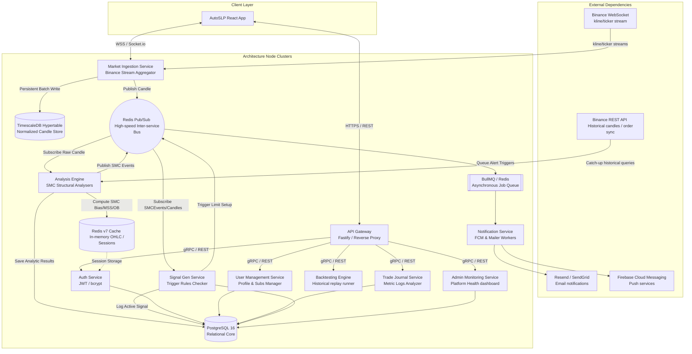

# AutoSLP Backend System Architecture & Implementation Specifications

AutoSLP is an institutional-grade Smart Money Concepts (SMC) automation, POI plotting, and trailing-limit signaling engine. This document details the master topographical architecture, communication interfaces, and runtime decisions comprising the platform.

---

## 1. System Communication Topography

The complete service architecture handles real-time normalization of Binance OHLC candle feeds, cached pattern analysis, multi-tenant state replication, and distributed event ingestion.

---

## 2. Shared Tech Stack & Component Justification

* **Runtime**: Node.js 20+ (LTS) with Assembly-Aided TypeScript. Low-memory heap footprint and dynamic assembly-level stripping for ultra-fast, single-thread task execution.
* **API Framework**: **Fastify**. High throughput JSON schema serialization, dynamic route maps compiling using `fast-json-stringify` and trie-based internal routers (`find-my-way`). High requests-per-second capability exceeding standard Express setups.
* **Persistent Layer**: PostgreSQL 16 core relational mapping coupled with the TimescaleDB extension. Leverages automated chronological time-series partitioning (*Hypertables*) to handle rapid candlestick inputs without page locking or index degradation.
* **Caching & IPC Plane**: Redis 7. Single-threaded in-memory store for high-frequency session buffers and high-volume raw candlestick pub/sub message propagation.
* **Async Job Worker Queue**: **BullMQ**. High-reliability task execution, built-in rate-limiting levels, automatic retry backoffs, and parent-child task relation logic.
* **ORM**: Prisma. Type-safe entity modeling and relation tracking, catching schema discrepancies at compile-time.
